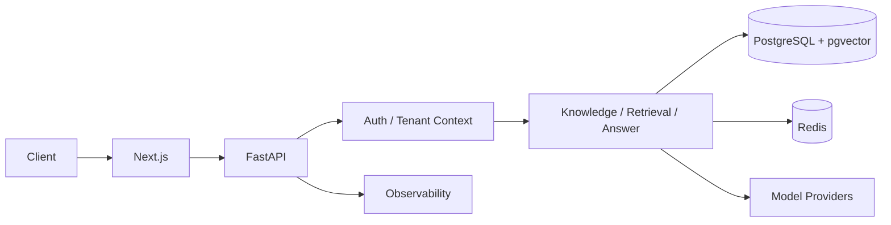

# AtlasCore

**Secure enterprise AI infrastructure for knowledge, retrieval, and grounded AI workflows.**

AtlasCore is a multi-tenant platform for ingesting organisation knowledge, retrieving it under database-enforced access control, and answering questions only from retrieved evidence. It is designed so tenant isolation, authentication boundaries, and auditability are system properties—not prompt instructions.

Latest verified UI v2 commit: `9d62e33`.

---

## Problem

Enterprise teams need AI systems that can use internal knowledge without:

- leaking data across organisations or workspaces
- answering from general model knowledge when evidence is weak
- treating retrieved documents as trusted instructions
- leaving auth, tenancy, and audit trails as application afterthoughts

AtlasCore addresses that by combining hybrid retrieval, evidence-gated answering, and PostgreSQL Row-Level Security (FORCE RLS) with a restricted application database role.

---

## Architecture



Request flow in brief:

1. Browser clients use the Next.js App Router UI.
2. FastAPI serves `/api/v1/*` with org-scoped authentication.
3. Tenant context is established for RLS before data access.
4. Knowledge, retrieval, and answering services enforce workspace/org boundaries in SQL and application code.
5. PostgreSQL (FTS + pgvector) and Redis hold durable data and short-lived session/cache state.
6. Answer providers receive only constructed prompts with trusted instructions separated from untrusted evidence.
7. Structured logging and OpenTelemetry configuration support local/runtime observability.

Full design notes: [docs/ARCHITECTURE.md](docs/ARCHITECTURE.md).

---

## Major capabilities

| Area | What is implemented |
|------|---------------------|
| Multi-tenant tenancy | Organisations, workspaces, invitations, teams |
| Workspace UX | Workspace listing, creation, switching, membership-aware session context |
| AuthN / AuthZ | Two-step login, org/workspace-scoped JWTs, refresh-token families, CSRF on cookie refresh, RBAC |
| Service access | Service accounts and API keys |
| Knowledge ingestion | Sources, documents, chunking, embeddings, blob storage |
| Hybrid retrieval | PostgreSQL FTS + pgvector cosine similarity, Reciprocal Rank Fusion (`k=60`), reranking |
| Grounded answering | Evidence packets, sufficiency gating, abstention on low evidence, citation validation |
| Prompt hygiene | Prompt-injection heuristics; trusted system instructions vs untrusted evidence separation |
| Providers | `deterministic-test`, OpenAI-compatible endpoint support, Anthropic |
| Evaluation | Deterministic evaluation runner and case suites |
| Audit | Append-oriented audit logging with restricted privileges |
| Observability | Request/correlation hooks, structured logs, OpenTelemetry settings |
| UI v2 | Dark application shell, grouped navigation, workspace selector, dashboard, knowledge, security and settings surfaces |

---

## Security model

AtlasCore treats tenancy and authorisation as database- and service-enforced controls.

- **Database-enforced tenant isolation** — tenant-scoped tables use RLS policies with `USING` and `WITH CHECK`, including fail-closed behaviour when tenant context is unset.
- **FORCE RLS** — policies apply even to table owners/privileged DB roles that would otherwise bypass RLS.
- **Restricted application DB role** — the runtime role is not superuser and does not hold `CREATEROLE`, `CREATEDB`, or `BYPASSRLS`.
- **Authentication / authorisation boundaries** — org/workspace membership is revalidated on protected routes and workspace context is bootstrapped before RLS-protected membership queries.
- **Audit controls** — security-relevant actions emit audit events; application privileges for audit mutation remain restricted.
- **Controlled provider boundaries** — retrieved content is evidence, not instructions; providers are not called when evidence is insufficient; provider failures must not leak secrets, stack traces, or system prompts.

Public policy and reporting: [SECURITY.md](SECURITY.md). Threat model: [docs/SECURITY.md](docs/SECURITY.md).

Do not commit secrets. Local credentials belong only in an untracked `.env` derived from `.env.example`.

---

## Knowledge ingestion and retrieval

1. **Ingest** — documents are accepted into workspace-scoped sources, stored as blobs, parsed, chunked, and embedded.
2. **Index** — lexical content is available to PostgreSQL full-text search; vectors are stored via pgvector.
3. **Retrieve** — queries run hybrid lexical + vector search with access-control predicates inside SQL so unauthorised chunks never reach ranking or model context.
4. **Fuse** — channel rankings are combined with Reciprocal Rank Fusion (`k=60`), then optionally reranked.
5. **Return** — callers receive ranked chunks with scores suitable for grounded answering.

---

## Grounded AI answering

The answering pipeline is evidence-first:

1. Normalise the question and retrieve candidate evidence.
2. Build an evidence packet and score sufficiency deterministically.
3. Abstain when evidence is empty or below the configured band.
4. Build a prompt with trusted instructions separated from untrusted evidence.
5. Call the configured provider only when evidence is sufficient.
6. Validate citations against retrieved evidence before returning an answer.

---

## Verified UI v2 state

The latest isolated VPS verification for commit `9d62e33` completed successfully with:

| Gate | Result |
|------|--------|
| Backend tests | **717 passed / 0 failed** |
| Deterministic evaluations | **46/46 passed / 100%** |
| Ruff | clean |
| mypy `--strict` | clean across 90 source files |
| Frontend lint | passed |
| Frontend TypeScript / type-check | passed |
| Frontend Vitest | passed |
| Frontend production build | passed |
| Workspace/RLS targeted DB tests | **216 passed** |
| FORCE RLS | preserved |
| Runtime application DB role | remained restricted |
| Existing verification stack | not modified during isolated test run |

The earlier `phase-2d-complete` tag remains the historical verified baseline and is intentionally not moved.

---

## Technology stack

| Layer | Choice |
|-------|--------|
| API | FastAPI (Python 3.12) |
| UI | Next.js 16 / TypeScript |
| Database | PostgreSQL 16 + pgvector |
| Cache / sessions | Redis |
| Packaging | Docker Compose, `uv`, npm |
| Providers | Deterministic test, OpenAI-compatible, Anthropic |
| Quality | pytest, Ruff, mypy `--strict`, ESLint, TypeScript, Vitest |

---

## Local development

### Prerequisites

- Docker ≥ 24 and Docker Compose v2
- Git
- Node.js matching the repository toolchain
- `uv` ≥ 0.5
- Python 3.12

### Configure

```bash
git clone https://github.com/miransec/atlascore.git
cd atlascore
cp .env.example .env
# Replace every required placeholder before starting.
```

### Start

```bash
docker compose up --build
```

Local Compose binds services to loopback only:

| Service | URL / port |
|---------|------------|
| Frontend | http://127.0.0.1:3100 |
| Backend API | http://127.0.0.1:8100 |
| API docs | http://127.0.0.1:8100/docs |
| PostgreSQL | 127.0.0.1:5433 |
| Redis | 127.0.0.1:6380 |

---

## Testing

Backend:

```bash
cd backend
uv run --all-extras ruff check app tests scripts
uv run --all-extras mypy --strict app
uv run --all-extras pytest tests/
```

Frontend:

```bash
cd frontend
npm install
npm run lint
npm run type-check
npx vitest run
npm run build
```

---

## Project structure

```text
atlascore/
├── backend/           FastAPI app, Alembic migrations, pytest suite
├── frontend/          Next.js App Router UI
├── docs/              Architecture, ADRs, security threat model
├── infra/docker/      DB init and related Docker assets
├── scripts/           Quality helpers
├── docker-compose.yml
├── PLAN.md
├── TASKS.md
├── SECURITY.md
└── LICENSE
```

---

## Project status

| Phase | Description | Status | Tag |
|-------|-------------|--------|-----|
| 0 | Foundation documents and architecture | Complete | `phase-0-complete` |
| 1A | Multi-tenant foundation (auth, orgs, RBAC, RLS) | Complete | `phase-1a-complete` |
| 1B | Invitations, teams, service accounts, API keys | Complete | `phase-1b-complete` |
| 2A | Knowledge ingestion | Complete | `phase-2a-complete` |
| 2B | Hybrid retrieval (FTS + pgvector + RRF) | Complete | `phase-2b-complete` |
| 2C | Grounded Q&A | Complete | `phase-2c-complete` |
| 2D | Providers, evaluation, observability hooks, UX polish | Complete | `phase-2d-complete` |
| UI v2 | Premium workspace-first application UX and workflow surfaces | Complete | commit `9d62e33` |
| 3+ | Analytics, controlled workflows, deeper security automation | Planned | — |

AtlasCore is under active development. It is not presented as a large-scale production deployment.

---

## Licence

MIT — see [LICENSE](LICENSE).
