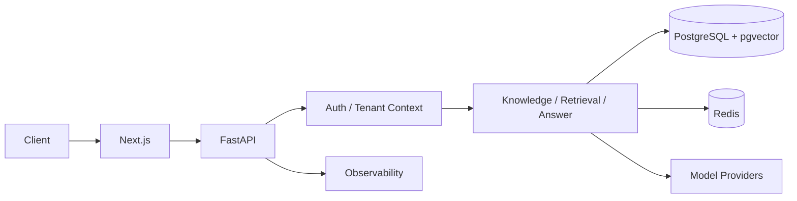

# AtlasCore

**Secure enterprise AI infrastructure for knowledge, retrieval, and grounded AI workflows.**


> Multi-tenant RAG platform where tenant isolation, auth boundaries, and auditability are database- and service-enforced properties — not prompt instructions. Evidence-gated answering abstains when retrieved context is insufficient. 709 tests. 100% deterministic eval pass rate. Built solo.

AtlasCore is a multi-tenant platform for ingesting organisation knowledge, retrieving it under database-enforced access control, and answering questions only from retrieved evidence. It is designed so tenant isolation, authentication boundaries, and auditability are system properties—not prompt instructions.

Current verified baseline: tag `phase-2d-complete` (`94b2946`).

---

## Problem

Enterprise teams need AI systems that can use internal knowledge without:

- leaking data across organisations or workspaces
- answering from general model knowledge when evidence is weak
- treating retrieved documents as trusted instructions
- leaving auth, tenancy, and audit trails as application afterthoughts

AtlasCore addresses that by combining hybrid retrieval, evidence-gated answering, and PostgreSQL Row-Level Security (FORCE RLS) with a restricted application database role.

---

## Architecture



Request flow in brief:

1. Browser clients use the Next.js App Router UI.
2. FastAPI serves `/api/v1/*` with org-scoped authentication.
3. Tenant context is established for RLS before data access.
4. Knowledge, retrieval, and answering services enforce workspace/org boundaries in SQL and application code.
5. PostgreSQL (FTS + pgvector) and Redis hold durable data and short-lived session/cache state.
6. Answer providers (deterministic test, OpenAI, or Anthropic) receive only constructed prompts with trusted instructions separated from untrusted evidence.
7. Structured logging and OpenTelemetry configuration support local/runtime observability.

Full design notes: [docs/ARCHITECTURE.md](docs/ARCHITECTURE.md).

---

## Major capabilities (current)

| Area | What is implemented |
|------|---------------------|
| Multi-tenant tenancy | Organisations, workspaces, invitations, teams |
| AuthN / AuthZ | Two-step login, org-scoped JWTs, refresh-token families, CSRF on cookie refresh, seven-role RBAC |
| Service access | Service accounts and API keys |
| Knowledge ingestion | Sources, documents, chunking, embeddings, blob storage |
| Hybrid retrieval | PostgreSQL FTS + pgvector cosine similarity, Reciprocal Rank Fusion (`k=60`), reranking |
| Grounded answering | Evidence packets, sufficiency gating, abstention on low evidence, citation validation |
| Prompt hygiene | Prompt-injection heuristics; trusted system instructions vs untrusted evidence separation |
| Providers | `deterministic-test` (default), OpenAI, Anthropic |
| Evaluation | Deterministic evaluation runner and case suites |
| Audit | Append-oriented audit logging with restricted privileges |
| Observability | Request/correlation hooks, structured logs, OpenTelemetry settings |

### Planned (not claimed as shipped)

Safe analytics SQL, workflow engine, tool registry / human approval gates, MCP server, and audit dashboards remain later phases (see [Project status](#project-status)).

---

## Security model

AtlasCore treats tenancy and authorisation as database- and service-enforced controls.

- **Database-enforced tenant isolation** — tenant-scoped tables use RLS policies with `USING` and `WITH CHECK`, including fail-closed behaviour when tenant context is unset.
- **FORCE RLS** — policies apply even to table owners/privileged DB roles that would otherwise bypass RLS.
- **Restricted application DB role** — the runtime role is not superuser and does not hold `CREATEROLE`, `CREATEDB`, or `BYPASSRLS`.
- **Authentication / authorisation boundaries** — credentials yield a short-lived pre-auth session; org selection issues an org-scoped access token; membership and RBAC are re-checked on protected routes. Refresh tokens use family rotation with reuse detection. Browser refresh uses HttpOnly cookies plus CSRF double-submit.
- **Audit controls** — security-relevant actions emit audit events; application privileges for audit mutation remain restricted.
- **Controlled provider / tool boundaries** — retrieved content is evidence, not instructions; providers are not called when evidence is insufficient; provider failures must not leak secrets, stack traces, or system prompts.

Public policy and reporting: [SECURITY.md](SECURITY.md). Threat model: [docs/SECURITY.md](docs/SECURITY.md).

Do not commit secrets. Local credentials belong only in an untracked `.env` derived from `.env.example`.

---

## Knowledge ingestion and retrieval

1. **Ingest** — documents are accepted into workspace-scoped sources, stored as blobs, parsed, chunked, and embedded.
2. **Index** — lexical content is available to PostgreSQL full-text search; vectors are stored via pgvector.
3. **Retrieve** — queries run hybrid lexical + vector search with access-control predicates inside SQL so unauthorised chunks never reach ranking or model context.
4. **Fuse** — channel rankings are combined with Reciprocal Rank Fusion (`k=60`), then optionally reranked.
5. **Return** — callers receive ranked chunks with scores suitable for grounded answering.

---

## Grounded AI answering

The answering pipeline is evidence-first:

1. Normalise the question and retrieve candidate evidence.
2. Build an evidence packet and score sufficiency deterministically.
3. Abstain when evidence is empty or below the configured band (low-evidence handling).
4. Build a prompt with trusted instructions separated from untrusted evidence.
5. Call the configured provider only when evidence is sufficient.
6. Validate citations against retrieved evidence before returning an answer.

Defaults favour the deterministic test provider (no external credentials). OpenAI and Anthropic are optional integrations.

---

## Evaluation system

Deterministic evaluation cases exercise retrieval behaviour, abstention, citation handling, injection resistance, and provider-failure hygiene. The suite is runnable without live LLM credentials via the deterministic provider path.

Verified baseline for this tag: **100% deterministic evaluation pass rate**.

---

## Observability

- Structured application logging and request identification headers
- OpenTelemetry-oriented configuration (`OTEL_*` settings) for traces/export wiring
- Health and readiness endpoints for runtime checks

Broader audit dashboards and production telemetry UX are planned for a later phase.

---

## Technology stack

| Layer | Choice |
|-------|--------|
| API | FastAPI (Python 3.12) |
| UI | Next.js 16 / TypeScript (Node 24) |
| Database | PostgreSQL 16 + pgvector |
| Cache / sessions | Redis |
| Packaging | Docker Compose, `uv`, npm |
| Providers | Deterministic test, OpenAI, Anthropic |
| Quality | pytest, Ruff, mypy `--strict`, ESLint, `tsc` |

---

## Local development

### Prerequisites

- Docker ≥ 24 and Docker Compose v2
- Git
- [nvm](https://github.com/nvm-sh/nvm) or Node.js 24 (see `.nvmrc`)
- [uv](https://github.com/astral-sh/uv) ≥ 0.5
- Python 3.12 (see `.python-version`)

### Configure

```bash
git clone https://github.com/your-org/atlascore.git
cd atlascore
nvm use
cp .env.example .env
# Replace every REPLACE_* secret before starting.
# Startup fails if required placeholders remain.
```

### Start

```bash
docker compose up --build
```

Local Compose binds services to loopback only (not public interfaces):

| Service | URL / port |
|---------|------------|
| Frontend | http://127.0.0.1:3100 |
| Backend API | http://127.0.0.1:8100 |
| API docs | http://127.0.0.1:8100/docs |
| PostgreSQL | 127.0.0.1:5433 |
| Redis | 127.0.0.1:6380 |

Do not publish these ports on `0.0.0.0` for shared or internet-facing hosts without an explicit hardening plan.

### Seed

```bash
docker compose exec backend python scripts/seed.py
```

### Provider configuration

```env
ANSWER_PROVIDER=deterministic-test   # default — no credentials
ANSWER_PROVIDER=openai               # requires OPENAI_API_KEY
ANSWER_PROVIDER=anthropic            # requires ANTHROPIC_API_KEY
ANSWER_DEMO_MODE=true                # force deterministic provider
EMBEDDING_PROVIDER=mock              # default
EMBEDDING_PROVIDER=openai            # requires OPENAI_API_KEY
```

---

## Testing

Backend (inside Compose / test stack):

```bash
docker compose exec backend ruff check app tests scripts
docker compose exec backend mypy --strict app
docker compose exec backend pytest --cov=app tests/
```

Frontend (Node 24):

```bash
cd frontend
npm install
npm run lint
npm run type-check
npm run build
```

Optional aggregated gate (requires running Compose services):

```bash
./scripts/quality-gate.sh
```

Runtime security smoke (restricted DB role / FORCE RLS checks) lives in `backend/scripts/verify_runtime_security.py`.

---

## Project structure

```
atlascore/
├── backend/           FastAPI app, Alembic migrations, pytest suite
│   ├── app/           auth, knowledge, retrieval, answering, evaluations, API
│   ├── scripts/       seed + runtime security verification
│   └── tests/
├── frontend/          Next.js App Router UI
├── docs/              Architecture, ADRs, security threat model
├── infra/docker/      DB init and related Docker assets
├── scripts/           quality-gate helper
├── docker-compose.yml Development stack (loopback-bound ports)
├── PLAN.md            Phased implementation plan
├── TASKS.md           Task registry
├── SECURITY.md        Public security policy
└── LICENSE            MIT
```

---

## Security considerations

- Keep `.env` out of version control; only `.env.example` (placeholders) is tracked.
- Replace all `REPLACE_*` values before startup.
- Prefer loopback binds for local Postgres/Redis/API/UI.
- Treat retrieved documents as untrusted data.
- Injection heuristics are advisory; RLS, RBAC, and evidence gating are primary controls.
- Report vulnerabilities privately per [SECURITY.md](SECURITY.md)—do not open public issues for sensitive findings.

---

## Verification

Verified on the `phase-2d-complete` baseline prior to this documentation pass:

| Gate | Result |
|------|--------|
| Backend tests | 709 passed / 0 failed |
| Deterministic evaluations | 100% pass rate |
| Ruff | clean |
| mypy `--strict` | clean across 90 source files |
| Frontend lint | passed |
| Frontend TypeScript / typecheck | passed |
| Frontend build | passed |
| Runtime security smoke | passed |
| Public wildcard listeners | none observed |
| PostgreSQL runtime role | no superuser / `CREATEROLE` / `CREATEDB` / `BYPASSRLS` |
| FORCE RLS | enabled |
| Exactly-one-owner invariant | enabled |
| Audit privileges | restricted |

This repository is the canonical source of truth for that baseline. Local reruns may require Docker, PostgreSQL, and Redis; if those services are unavailable, the previously verified runtime result remains authoritative.

---

## Project status

| Phase | Description | Status | Tag |
|-------|-------------|--------|-----|
| 0 | Foundation documents and architecture | Complete | `phase-0-complete` |
| 1A | Multi-tenant foundation (auth, orgs, RBAC, RLS) | Complete | `phase-1a-complete` |
| 1B | Invitations, teams, service accounts, API keys | Complete | `phase-1b-complete` |
| 2A | Knowledge ingestion | Complete | `phase-2a-complete` |
| 2B | Hybrid retrieval (FTS + pgvector + RRF) | Complete | `phase-2b-complete` |
| 2C | Grounded Q&A | Complete | `phase-2c-complete` |
| 2D | Providers, evaluation, observability hooks, UX polish | Complete | `phase-2d-complete` |
| 3 | Safe analytics database | Planned | — |
| 4 | Workflow engine | Planned | — |
| 5 | Tool registry and approvals | Planned | — |
| 6 | MCP integration | Planned | — |
| 8 | Observability and audit dashboards | Planned | — |
| 9 | Security hardening and deployment | Planned | — |

AtlasCore is under active development. It is not presented here as a large-scale production deployment.

---

## Licence

MIT — see [LICENSE](LICENSE).
